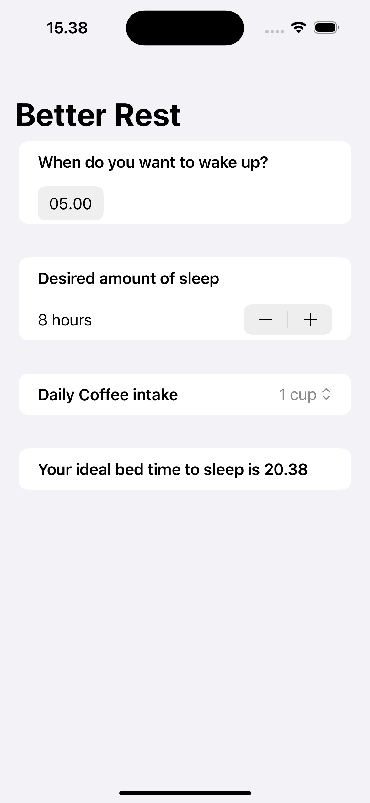

# BetterRest

This is a basic learning project to calculate you coffee intake and how mouch sleep you have to help you wake up in your designated time by showing when you should get to sleep.
The source learning is from 4th project of course "100 Days of SwiftUI" (https://www.hackingwithswift.com/100/swiftui)

---
## Goals
1. Display a main view showing form to input the target wake up time, desired amount of sleep and daily amout of coffee intake.
2. Display a main view showing result of ideal time to sleep based on the form input.
3. Set limit to amount of sleep from 4 to 12 hours and daily coffee intake from 1 to 20 cup.
4. The result of ideal time to sleep should change everytime the form input in updated.

# BetterRest – Image Comments Feature

---

